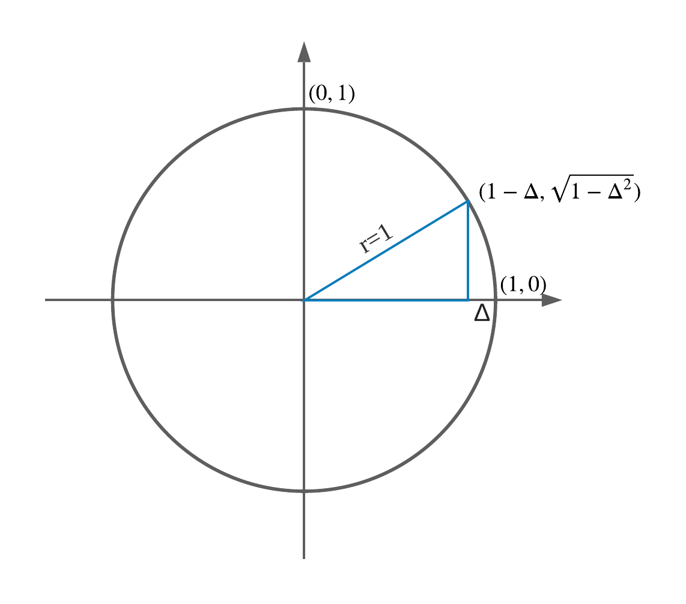

# 使用勾股定理求PI近似值

计算1/4个圆的周长，在(1,0)到(0,1)之间求10亿(1 billion)个点，计算俩俩之间的距离并求和，然后乘以4除以2即得出PI的近似值。



```
$ gcc main.c -lm && time ./a.out 
calc_pi=3.1415926515897837, real_pi=3.1415926535897931, margin of error is -0.0000000020000095

real    1m15.660s
user    1m15.649s
sys     0m0.004s
```

```
$ time node main.js 
iter=1000000000, real_s=6.283185307179586, calc_s=6.283185303273445, real_pi=3.141592653589793, calc_pi=3.1415926516367225

real    0m9.023s
user    0m9.836s
sys     0m0.323s
```

为什么同样是10亿次迭代，js代码执行的比C快好多？

```
$ lscpu | grep -A4 Model
Model:                           60
Model name:                      Intel(R) Core(TM) i7-4770 CPU @ 3.40GHz
Stepping:                        3
CPU MHz:                         2720.285
CPU max MHz:                     3900.0000
CPU min MHz:                     800.0000
```